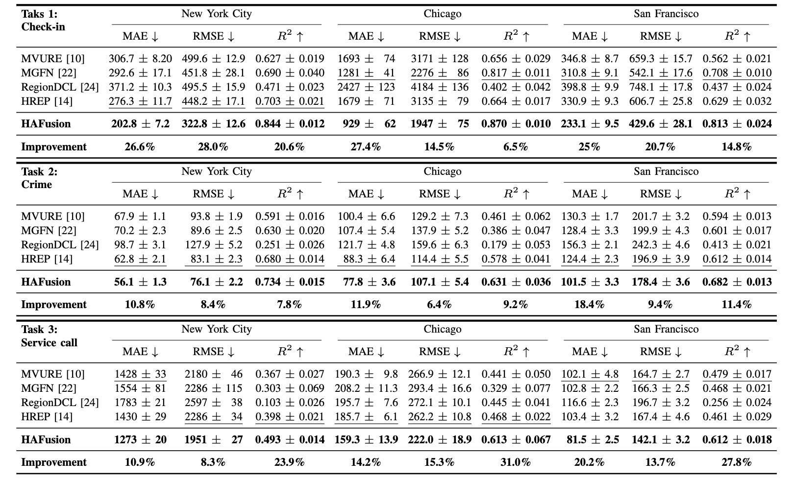
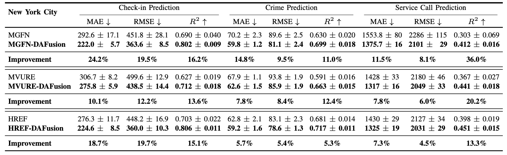

# HAFusion: Urban Region Representation Learning with Attentive Fusion (ICDE 2024)

This is a pytorh implementation of the [HAFusion paper](https://arxiv.org/abs/2312.04606)

Authors: Fengze Sun, Jianzhong Qi, Yanchuan Chang, Xiaoliang Fan, Shanika Karunasekera, and Egemen Tanin

## Model Structure
<p align="center">
    
</p>

## Experiments
<p align="center"><strong>Overall Prediction Accuracy Results</strong></p>
<p align="center">
     
</p>

<p align="center"><strong>Prediction Accuracy Results When Powering Existing Models with Our DAFusion Module (NYC)</strong></p>
<p align="center">
     
</p>

## Requirements
- Python 3.8.18
- `pip install -r requirements.txt`

## Quick Start
To train and test HAFusion on NYC dataset:

```bash
python main_NY.py
```

To train and test HAFusion on Chicago dataset:

```bash
python main_Chi.py
```

To train and test HAFusion on San Francisco dataset:

```bash
python main_SF.py
```